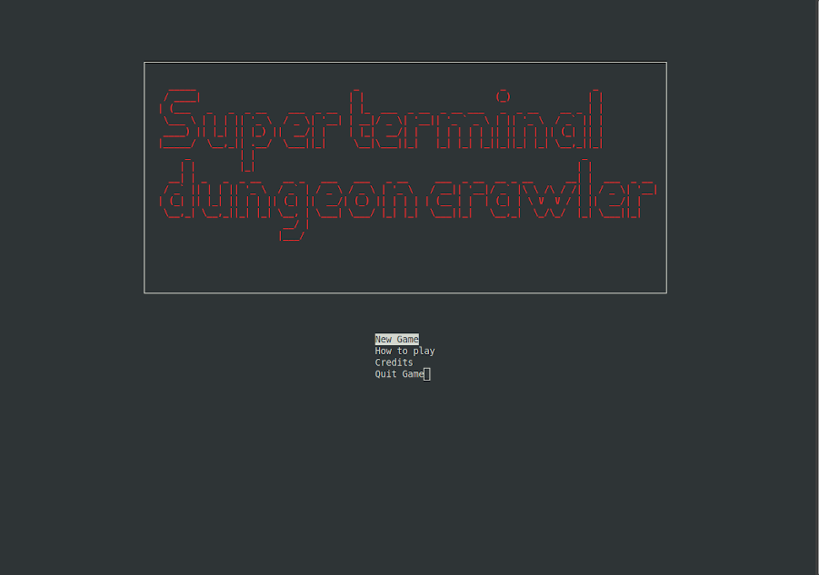
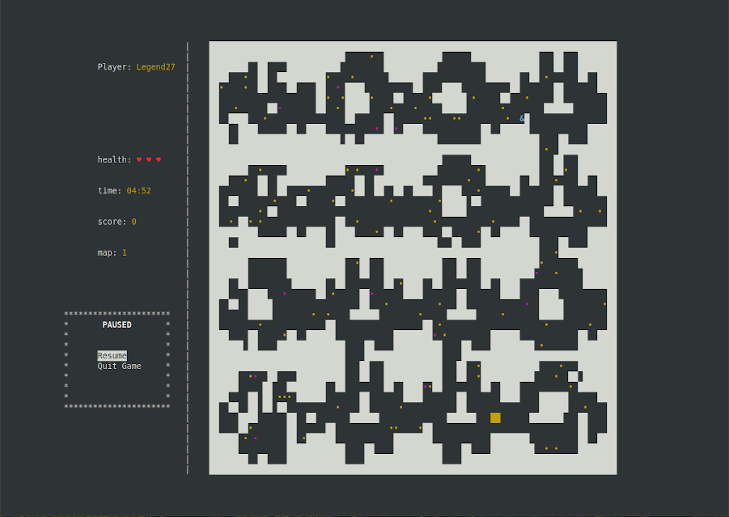

# Super Terminal Dungeon Crawler
I made this simple game as end project during my C course at my university.

The point of this game is to collect coins and make through a procedural generated map. You can destroy walls by planting bombs. You lose health when you find yourself in a range of explosion. The game ends when you lose all health points or time is up.

Whole project is written in C and based on ncurses library. If you want to compile this code on your own, make sure you have both gcc compiler and ncurses library installed on your Linux machine. If not, then do so with following commands (for debian based distros):

<!-- Code Blocks -->
```
    sudo apt install libncurses5-dev libncursesw5-dev    (ncurses)
    sudo apt install build-essential                     (gcc)
```

Most of default Linux terminals should be able to display this game just fine.

## How to run this?
You have couple options. If you have ncurses and gcc compiler installed on your machine then you can use Makefile I prepared and run (in cloned repo directory)
<!-- Code Blocks -->
```
    make                    (to compile)
    make run                (to run)
```
in your terminal.

If you are familiar with docker, then you can use Dockerfile I also prepared to build your own image and run container with this game. While being in cloned repo directory, type in terminal following commands: 
<!-- Code Blocks -->
```
    docker image build -t image_name .                  (to build image)
    docker container run --name stdc -it image_name     (to run container)
```
## Noted bugs
From time to time there is a possibilty of generating a maze without a way out. Good thing you have bombs to blast your way through walls.

## Screenshots
This project is far from being finished, so you may encounter some bugs during the play, but it's playable at this state. Maybe one day I'll find some time and will to make it finished. For now I decided to leave it as it is.





